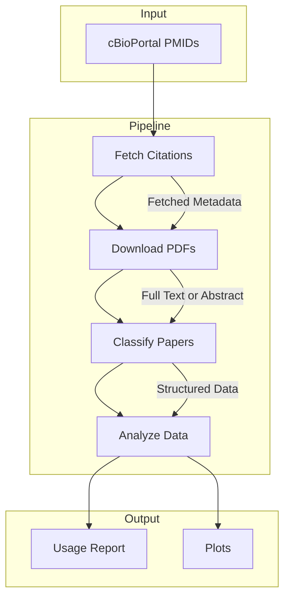

# cBioPortal Article Classification

> **⚠️ WORK IN PROGRESS**
> This tool is currently under active development and was vibe-coded. Use at your own risk!
> Expect bugs, breaking changes, and incomplete features.

## 📊 See the Latest Results

**[→ View the latest usage analysis report](output/reports/usage_report.md)**

This report includes embedded visualizations, analysis types, research areas, cancer types, temporal trends, and detailed summaries of how researchers use cBioPortal.

---

A comprehensive tool for fetching, classifying, and analyzing scientific papers that cite cBioPortal using LLM-based classification.

## Features

- **Automated Citation Fetching**: Retrieves citations from PubMed with incremental updates
- **Citation Context Extraction**: Extracts specific paragraphs where cBioPortal is mentioned from JATS XML
- **PDF & XML Download**: Downloads full-text PDFs and XML from PMC/bioRxiv/Unpaywall
- **LLM-Based Classification**: Uses Claude (via AWS Bedrock) with structured outputs (Pydantic + instructor)
  - **OncoTree integration**: Specific tumor type codes (e.g., STAD, BRCA, LUAD)
  - **Citation tracking**: Tracks whether papers cite data sources (TCGA, METABRIC) and cBioPortal platform papers
  - **Usage classification**: Data download, web analysis, API access, etc.
- **Rich Analysis**: Generates visualizations and markdown reports

## Quick Start

### Prerequisites
- Python 3.11+
- AWS account with Bedrock access
- Email address (required for NCBI Entrez API)

### Installation

```bash
# Clone and install
cd cbioportal-article-classification
uv sync

# Activate virtual environment
source .venv/bin/activate  # or activate.fish for fish

# Configure environment
cp .env.example .env
# Edit .env with your NCBI_EMAIL and AWS settings
```

Required in `.env`:
```bash
NCBI_EMAIL=your.email@example.com
AWS_REGION=us-east-1
AWS_PROFILE=default
BEDROCK_MODEL_ID=anthropic.claude-3-sonnet-20240229-v1:0
```

## Usage

```bash
# 1. Fetch reference data (cBioPortal studies + OncoTree codes + data source papers)
cbioportal-classify fetch-reference-data

# 2. Check status
cbioportal-classify status

# 3. Fetch citations and download PDFs/XMLs
cbioportal-classify fetch --max-downloads 50

# Fetch mode examples
cbioportal-classify fetch --mode citing-article-metadata  # Metadata only
cbioportal-classify fetch --mode citing-article-files      # PDFs/XMLs only
cbioportal-classify fetch --pmid 41386847                  # Specific paper

# 4. Extract citation contexts from XML files
cbioportal-classify extract-citations

# 5. Classify papers using LLM
cbioportal-classify classify                    # Auto: sentences → PDF → abstract
cbioportal-classify classify --source sentences # Citation contexts only
cbioportal-classify classify --source pdf       # Full PDF text only
cbioportal-classify classify --source both      # PDF + citation contexts
cbioportal-classify classify --pmid 40075071    # Specific paper

# 6. Generate analysis report
cbioportal-classify analyze

# Or run everything at once
cbioportal-classify run-all
```

## Key Commands

| Command | Description |
|---------|-------------|
| `fetch-reference-data` | Fetch cBioPortal studies, OncoTree codes, and data source papers metadata |
| `status` | Show database state (citations, PDFs, XMLs, classifications) |
| `fetch` | Fetch citations and files (default `mode=all`) |
| `fetch --mode citing-article-metadata` | Fetch/refresh citation metadata and reference lists |
| `fetch --mode citing-article-files` | Download PDFs and XMLs using existing metadata |
| `fetch --pmid <PMID>` | Fetch specific paper(s) |
| `extract-citations` | Extract citation contexts from JATS XML files |
| `classify` | Classify papers (auto: sentences → PDF → abstract) |
| `classify --source sentences` | Classify using citation contexts only |
| `classify --source pdf` | Classify using full PDF text |
| `classify --source both` | Classify using PDF + citation contexts |
| `classify --reclassify` | Force re-classification of existing papers |
| `classify --pmid <PMID>` | Classify specific paper(s) |
| `analyze` | Generate visualizations and markdown report |
| `run-all` | Execute complete pipeline |

## Output Files

### Reports & Visualizations
- `output/reports/usage_report.md` - Analysis report with embedded visualizations
- `output/plots/` - PNG visualizations (usage analysis, research areas)

### Classification Data
- `data/metadata/classifications.json` - Structured classification data (schema v7)
- `data/metadata/classifications.csv` - Classifications in CSV format

### Metadata
- `data/metadata/citations.json` - Citation metadata and reference lists
- `data/metadata/citation_sentences.json` - Extracted citation contexts from XMLs
- `data/metadata/cbioportal_studies.json` - cBioPortal study metadata
- `data/metadata/data_source_papers.json` - Data source papers (TCGA, METABRIC, etc.)
- `data/metadata/oncotree_tumor_types.json` - OncoTree tumor type codes

### Files
- `data/pdfs/` - Downloaded PDFs
- `data/xml/` - Downloaded JATS XML files

## Workflow



### How It Works

1.  **Reference Data**: Fetches cBioPortal study metadata, OncoTree tumor type codes, and data source paper metadata (TCGA, METABRIC, etc.)
2.  **Citation Fetcher**: Uses NCBI's Entrez API to:
    - Find papers citing cBioPortal papers (Cerami 2012, Gao 2013, de Bruijn 2023)
    - Fetch reference lists (bibliography) for each citing paper
    - Download PDFs from PMC/bioRxiv/Unpaywall
    - Download JATS XML files from PMC
3.  **Citation Extractor**: Parses JATS XML to extract specific paragraphs where cBioPortal is mentioned
4.  **Classifier**: Uses Claude Sonnet 4.5 via AWS Bedrock with `instructor` + Pydantic for structured outputs
    - **Schema v7** with OncoTree codes, usage tracking, and citation analysis
    - Prioritizes citation contexts → full PDF → abstract
    - Tracks whether papers cite data sources (TCGA, METABRIC) and cBioPortal platform papers
5.  **Analyzer**: Generates temporal trends, breakdowns by category, and comprehensive markdown reports with embedded plots

## Configuration

Edit `src/cbioportal_article_classification/config.py` to:
- Add/modify classification categories
- Change cBioPortal PMIDs being tracked
- Adjust AWS Bedrock model

## Troubleshooting

**NCBI rate limits**: Get a free [NCBI API key](https://www.ncbi.nlm.nih.gov/account/settings/) for 10 req/sec instead of 3 req/sec

**PDF downloads fail**: Tool will still classify using abstracts. PDFs are often behind paywalls.

**AWS Bedrock errors**: Ensure credentials have Bedrock access and model ID is correct for your region

## License

MIT

## Citation

If you use this tool, please cite the cBioPortal papers:
- de Bruijn et al. (2023) Cancer Res. PMID: 37668528
- Gao et al. (2013) Sci. Signal. PMID: 23550210
- Cerami et al. (2012) Cancer Discov. PMID: 22588877
