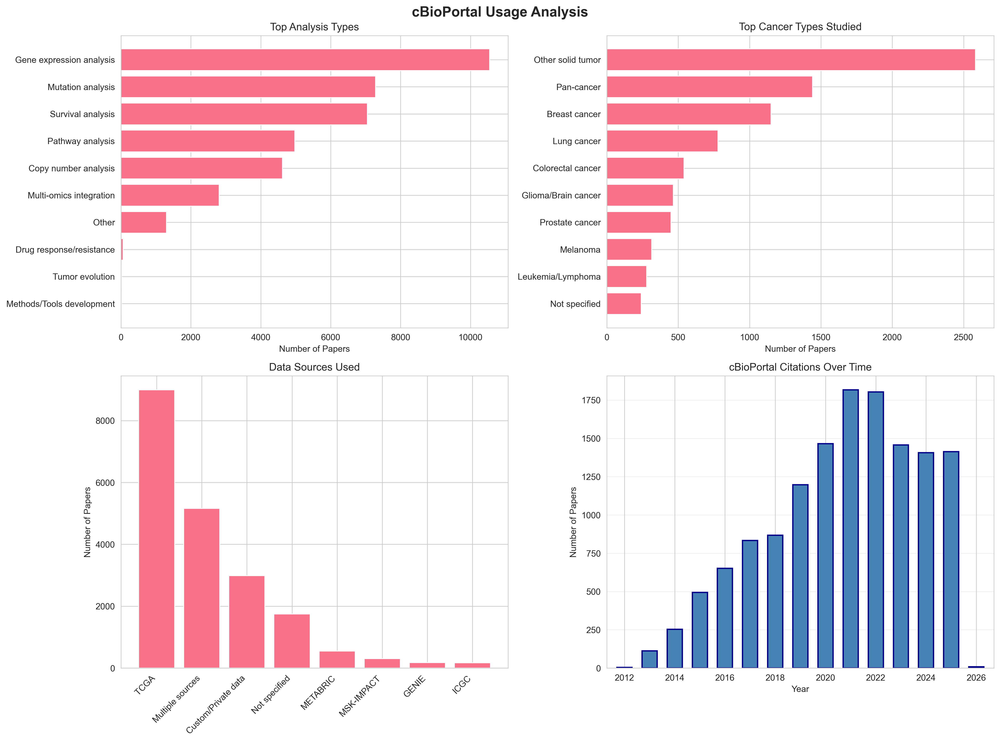
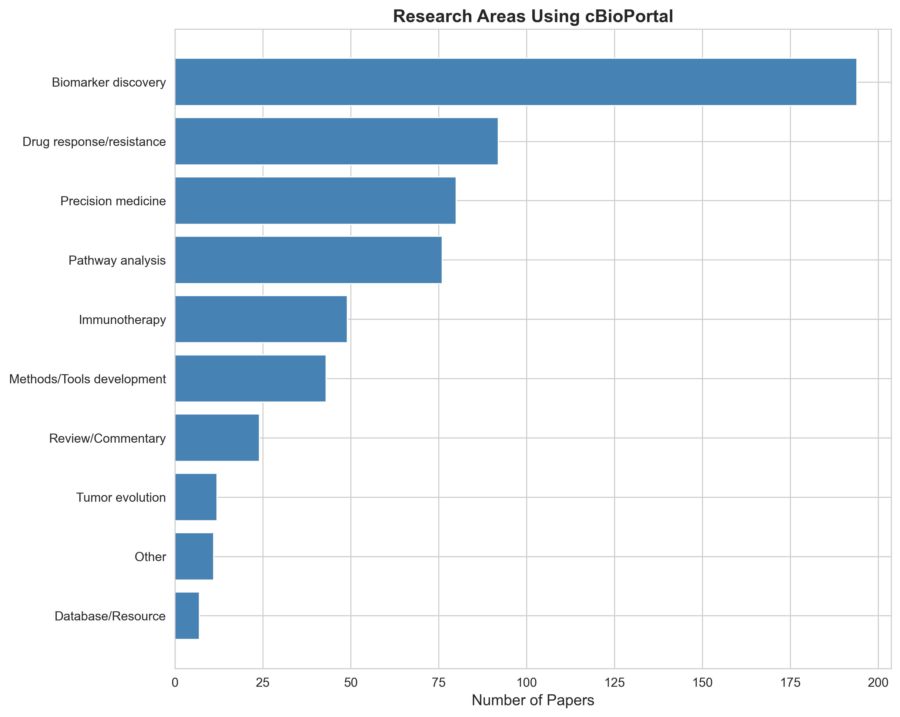

# cBioPortal Usage Analysis Report

*Generated on 2025-12-19 02:53:54*

---

## Summary Statistics

- **Total Papers Analyzed**: 233
- **Year Range**: 2024 - 2026
- **Classified from Full PDF**: 2 (0.9%)
- **Classified from Abstract Only**: 98 (42.1%)
- **Most Common Analysis Type**: Gene expression analysis
- **Most Common Cancer Type**: Other solid tumor
- **Most Common Data Source**: Multiple sources

## Visualizations

### Usage Analysis Overview

*Four-panel visualization showing analysis types, cancer types, data sources, and temporal trends.*

### Research Areas

*Distribution of research areas utilizing cBioPortal.*

---

## Top Analysis Types

1. Gene expression analysis: 172 papers
2. Survival analysis: 127 papers
3. Mutation analysis: 122 papers
4. Pathway analysis: 104 papers
5. Multi-omics integration: 53 papers
6. Copy number analysis: 49 papers
7. Other: 30 papers

## Top Cancer Types

1. Other solid tumor: 80 papers
2. Pan-cancer: 58 papers
3. Breast cancer: 44 papers
4. Lung cancer: 24 papers
5. Colorectal cancer: 24 papers
6. Prostate cancer: 19 papers
7. Glioma/Brain cancer: 15 papers
8. Leukemia/Lymphoma: 13 papers
9. Melanoma: 9 papers
10. Not specified: 7 papers

## Data Sources Used

1. Multiple sources: 101 papers
2. TCGA: 100 papers
3. Custom/Private data: 65 papers
4. Not specified: 47 papers
5. MSK-IMPACT: 6 papers
6. GENIE: 6 papers
7. METABRIC: 4 papers
8. ICGC: 1 papers

## Recent Papers Using cBioPortal

### The Roles of TOPK in Tumorigenesis and Development: Structure, Mechanisms, Pathways, and Therapeutic Implications. (2026)

- **Research Area**: ['Review/Commentary', 'Pathway analysis', 'Drug response/resistance']
- **Cancer Type**: ['Pan-cancer']
- **Usage**: This is a review paper examining TOPK's role in tumorigenesis and cancer development. Based on the abstract and introduction provided, there is no explicit description of how cBioPortal was used in this study. The paper appears to cite cBioPortal as a reference source for cancer genomics data that may have been used to support discussions of TOPK expression patterns and its role across various cancers, but specific usage details are not provided in the available text.

### EGFR amplification and PI3K pathway mutations identify a subset of breast cancers that synergistically respond to EGFR and PI3K inhibition. (2026)

- **Research Area**: ['Biomarker discovery', 'Drug response/resistance', 'Pathway analysis', 'Precision medicine']
- **Cancer Type**: ['Breast cancer']
- **Usage**: cBioPortal was likely used to identify and analyze the frequency of EGFR amplification in breast cancer patients and to determine the co-occurrence of PI3K pathway mutations in EGFR-amplified tumors. The platform was used to perform survival analysis comparing overall survival between EGFR amplified and unamplified breast cancer patients. The study identified that EGFR amplification occurs in 1-5% of breast cancer patients and that up to 71% of EGFR amplified tumors harbor activating PI3K pathway mutations.

### Secreted frizzled-related protein 1a regulates hematopoietic development in a dose-dependent manner. (2026)

- **Research Area**: ['Other']
- **Cancer Type**: ['Not specified']
- **Usage**: This paper does not appear to directly use cBioPortal for its primary research. The study focuses on developmental biology using zebrafish models to investigate Sfrp1a's role in hematopoietic stem and progenitor cell development. The citation to cBioPortal is likely a reference to support the statement about SFRP1 variants in hematopoietic cancers mentioned in the abstract, rather than indicating actual data analysis using the platform.

### Cohesin mutations and chromatin changes in cancer. (2026)

- **Research Area**: ['Review/Commentary']
- **Cancer Type**: ['Pan-cancer']
- **Usage**: This is a review paper that discusses cohesin mutations across different cancer types. While cBioPortal is cited as a reference, the abstract and introduction do not provide specific details about how cBioPortal data was directly used or analyzed in this review. The paper likely references cBioPortal as a source for mutation prevalence data across cancer types, but specific usage details are not evident from the provided text.

### Investigating the role of oncogenic FAM83A as a prognostic biomarker in lung adenocarcinoma: Insights from smoker and non-smoker cohorts. (2025)

- **Research Area**: ['Biomarker discovery', 'Pathway analysis', 'Immunotherapy']
- **Cancer Type**: ['Lung cancer']
- **Usage**: The study utilized cBioPortal to access and analyze TCGA-LUAD cohort data to identify prognostic biomarkers in lung adenocarcinoma. The platform was used to examine FAM83A amplification patterns and validate the prognostic significance of meta-differentially expressed genes. Additionally, cBioPortal facilitated the analysis of copy number alterations and their correlation with immune cell infiltration in LUAD samples from smokers and non-smokers.

### Clinical and Molecular Characterization of KRAS-Mutated Renal Cell Carcinoma. (2025)

- **Research Area**: ['Biomarker discovery', 'Precision medicine']
- **Cancer Type**: ['Other solid tumor']
- **Usage**: The study identified KRAS-mutant RCC patients from two major cohorts: the MSK-IMPACT and TCGA-KIRP datasets, which are commonly accessed through cBioPortal. The researchers used these datasets to characterize the clinical, pathologic, and molecular features of KRAS-mutated renal cell carcinoma, including mutation profiles and copy number alterations. cBioPortal likely served as the primary platform for querying and retrieving genomic data from these cohorts.

### Synergy in Immunostimulatory and Pro-Differentiation Effects of Vitamin D Analog and Fludarabine in Acute Myeloid Leukemias. (2025)

- **Research Area**: ['Drug response/resistance', 'Biomarker discovery']
- **Cancer Type**: ['Leukemia/Lymphoma']
- **Usage**: Based on the abstract and introduction provided, the specific usage of cBioPortal is not explicitly described. The paper focuses on investigating differentiation therapy using vitamin D analog (PRI5202) and Fludarabine in AML cells, particularly those with activating mutations in FGFR and JAK pathways. cBioPortal may have been used to identify or validate mutation patterns in these pathways, but the exact usage is not detailed in the provided text.

### N6-Methyladenosine: an RNA modification as a central regulator of cancer. (2025)

- **Research Area**: ['Review/Commentary', 'Drug response/resistance', 'Biomarker discovery', 'Immunotherapy']
- **Cancer Type**: ['Pan-cancer', 'Leukemia/Lymphoma']
- **Usage**: This is a review paper discussing N6-methyladenosine (m6A) RNA modification in cancer. Based on the abstract and introduction provided, there is no explicit mention of cBioPortal usage in the text. The paper appears to cite cBioPortal as a reference resource but does not describe specific analyses performed using the platform.

### EIF3M as a pan-cancer biomarker: prognostic significance and immune infiltration association. (2025)

- **Research Area**: ['Biomarker discovery', 'Immunotherapy', 'Pathway analysis']
- **Cancer Type**: ['Pan-cancer', 'Other solid tumor']
- **Usage**: cBioPortal was likely used as one of the publicly available databases to access multi-omics cancer data for the comprehensive pan-cancer analysis of EIF3M. The platform would have facilitated the analysis of gene expression patterns, copy number alterations (gene amplification), methylation data, and survival outcomes across multiple cancer types. Given the integrative multi-omics approach described, cBioPortal served as a key resource for obtaining and analyzing TCGA and other cancer genomics datasets.

### A Prognostic Neuromodulation-Related Gene Signature Identifies Immunomodulation and Tumour-Associated Hallmarks in Glioblastoma. (2025)

- **Research Area**: ['Biomarker discovery', 'Pathway analysis', 'Immunotherapy']
- **Cancer Type**: ['Glioma/Brain cancer']
- **Usage**: Based on the abstract and introduction provided, the paper does not explicitly mention cBioPortal usage. The study utilized transcriptomic data from GSE147352, GSE165595, TCGA, and CGGA databases to perform differential expression analysis and survival analysis. While TCGA data was used (which is available through cBioPortal), there is no direct mention of cBioPortal as the data access platform in the provided text.
