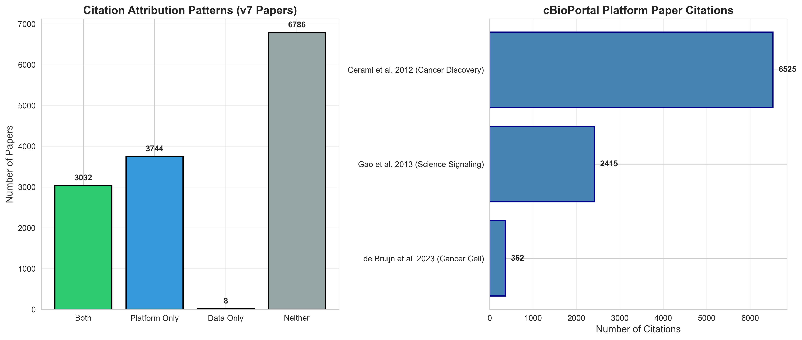

# cBioPortal Usage Analysis Report

*Generated on 2025-12-20 13:41:47*

---

## Summary Statistics

- **Total Papers Analyzed**: 13890
- **Year Range**: 2012 - 2026
- **Classified from Full PDF**: 385 (2.8%)
- **Classified from Abstract Only**: 7271 (52.3%)
- **Most Common Analysis Type**: Gene expression analysis
- **Most Common Cancer Type**: Other solid tumor

## Data Collection & Limitations

This analysis is based on papers that cite the three main cBioPortal publications:

- PMID 37668528
- PMID 23550210
- PMID 22588877

**Total citations in database**: 10,238 papers
**Unique papers** (deduplicated): 6,854 papers
**Papers citing multiple cBioPortal publications**: 3,096 papers

**Important limitation**: The PubMed eutils API returns fewer citations than shown on the PubMed website. 
For example, PMID 37668528 shows 750 citations on PubMed's website but the API only returns 407 citations. 
This is a known limitation of the eutils citation indexing system. 
Our analysis is based on the subset of citations available through the API.

## Citation Analysis

*Analysis of citation patterns based on reference PMID metadata from Europe PMC*

**Note**: This analysis covers 6,854 papers with available reference metadata (~49% of total papers). 
Papers classified from abstracts only don't have reference lists available.

### Platform Paper Citation Overlap

- Papers citing only 1 cBioPortal publication: 3,758
- Papers citing 2 cBioPortal publications: 2,808
- Papers citing all 3 cBioPortal publications: 288

### Co-Citation with Data Source Papers

- **Papers citing cBioPortal platform AND underlying data sources**: 3,713 (54.2%)
- **Papers citing cBioPortal platform only**: 3,140
- **Papers citing data source papers only**: 0

### Most Frequently Co-Cited Data Sources

1. **TCGA Pan-Cancer Analysis** (PMID 23000897): 424 papers
2. **TCGA Endometrial Carcinoma** (PMID 22460905): 341 papers
3. **TCGA Lung Adenocarcinoma** (PMID 22522925): 286 papers
4. **TCGA Lung Squamous Cell Carcinoma** (PMID 22810696): 279 papers
5. **TCGA Glioblastoma** (PMID 21720365): 238 papers
6. **TCGA Ovarian Cancer** (PMID 20579941): 202 papers
7. **TCGA Kidney Renal Clear Cell Carcinoma** (PMID 25079552): 200 papers
8. **PMID 27161491** (PMID 27161491): 163 papers
9. **TCGA Glioblastoma (Original)** (PMID 18772890): 163 papers
10. **PMID 22960745** (PMID 22960745): 163 papers

## Citation Attribution Analysis (v7 Schema)

*Analysis of how papers cite cBioPortal platform vs. underlying data sources*

- **Total v7 papers analyzed**: 6,786
- **Papers citing cBioPortal platform papers**: 6,776 (99.9%)
- **Papers citing underlying data source papers**: 3,040 (44.8%)
- **Papers citing BOTH platform and data sources**: 3,032 (44.7%)
- **Papers citing platform ONLY**: 3,744 (55.2%)

### Individual Platform Paper Citations

- Cerami et al. 2012 (Cancer Discovery): 6,525 citations
- Gao et al. 2013 (Science Signaling): 2,415 citations
- de Bruijn et al. 2023 (Cancer Cell): 362 citations

## Visualizations

### Usage Analysis Overview

*Four-panel visualization showing analysis types, cancer types, and temporal trends.*

### Citation Attribution Patterns

*v7 schema: How papers cite cBioPortal platform vs. data sources, and breakdown by platform paper.*

### Research Areas

*Distribution of research areas utilizing cBioPortal.*

---

## Top Analysis Types

1. Gene expression analysis: 10549 papers
2. Mutation analysis: 7282 papers
3. Survival analysis: 7050 papers
4. Pathway analysis: 4975 papers
5. Copy number analysis: 4617 papers
6. Multi-omics integration: 2806 papers
7. Other: 1299 papers
8. Drug response/resistance: 57 papers
9. Tumor evolution: 19 papers
10. Methods/Tools development: 17 papers

## Top Cancer Types

1. Other solid tumor: 2583 papers
2. Pan-cancer: 1442 papers
3. Breast cancer: 1151 papers
4. Lung cancer: 779 papers
5. Colorectal cancer: 541 papers
6. Glioma/Brain cancer: 466 papers
7. Prostate cancer: 449 papers
8. Melanoma: 315 papers
9. Leukemia/Lymphoma: 279 papers
10. Not specified: 241 papers

## How cBioPortal is Being Used

1. Citation only: 6089 papers
2. Web-based analysis: 5930 papers
3. Web-based visualization: 3751 papers
4. Data download/export: 3312 papers
5. Query interface: 231 papers
6. API access: 82 papers
7. Expression analysis: 10 papers
8. Unclear: 7 papers
9. Group comparison: 2 papers
10. Methods/Tools development: 2 papers
11. Download data: 2 papers
12. Database/Resource: 1 papers
13. Not applicable - cBioPortal not used: 1 papers
14. Survival analysis: 1 papers

## cBioPortal Features Used

1. Not specified: 6351 papers
2. Query interface: 4556 papers
3. Expression analysis: 3525 papers
4. Download data: 2836 papers
5. Survival analysis: 1732 papers
6. Mutation Mapper: 664 papers
7. Group comparison: 524 papers
8. OncoPrint: 514 papers
9. Enrichment analysis: 64 papers
10. Web-based visualization: 57 papers

## Where Analysis Was Performed

1. Unclear: 6246 papers
2. cBioPortal platform: 2991 papers
3. External (downloaded data): 2591 papers
4. Mixed: 1046 papers
5. ["Unclear"]: 374 papers
6. ["cBioPortal platform"]: 245 papers
7. ["External (downloaded data)"]: 158 papers
8. ["Mixed"]: 130 papers
9. External: 2 papers
10. Not applicable - This study does not use cBioPortal: 1 papers

## Most Frequently Queried Genes

1. TP53: 1062 papers
2. KRAS: 545 papers
3. EGFR: 444 papers
4. PIK3CA: 423 papers
5. PTEN: 354 papers
6. BRAF: 321 papers
7. MYC: 260 papers
8. CDKN2A: 248 papers
9. ERBB2: 207 papers
10. BRCA1: 193 papers
11. BRCA2: 179 papers
12. IDH1: 159 papers
13. NRAS: 158 papers
14. RB1: 154 papers
15. ARID1A: 132 papers
16. APC: 122 papers
17. ATM: 119 papers
18. NF1: 119 papers
19. CTNNB1: 116 papers
20. MET: 114 papers

## Top 50 Most Frequently Queried Genes

1. **TP53**: 1062 papers
2. **KRAS**: 545 papers
3. **EGFR**: 444 papers
4. **PIK3CA**: 423 papers
5. **PTEN**: 354 papers
6. **BRAF**: 321 papers
7. **MYC**: 260 papers
8. **CDKN2A**: 248 papers
9. **ERBB2**: 207 papers
10. **BRCA1**: 193 papers
11. **BRCA2**: 179 papers
12. **IDH1**: 159 papers
13. **NRAS**: 158 papers
14. **RB1**: 154 papers
15. **ARID1A**: 132 papers
16. **APC**: 122 papers
17. **ATM**: 119 papers
18. **NF1**: 119 papers
19. **CTNNB1**: 116 papers
20. **MET**: 114 papers
21. **CD274**: 107 papers
22. **CDH1**: 107 papers
23. **SMAD4**: 103 papers
24. **AR**: 101 papers
25. **AKT1**: 97 papers
26. **CCND1**: 94 papers
27. **HRAS**: 92 papers
28. **ESR1**: 92 papers
29. **IDH2**: 89 papers
30. **TERT**: 86 papers
31. **NOTCH1**: 83 papers
32. **KEAP1**: 83 papers
33. **FGFR1**: 77 papers
34. **STK11**: 76 papers
35. **PIK3R1**: 72 papers
36. **FGFR3**: 72 papers
37. **CDK1**: 68 papers
38. **POLE**: 68 papers
39. **EZH2**: 67 papers
40. **BAP1**: 67 papers
41. **HER2**: 66 papers
42. **SMARCA4**: 65 papers
43. **MDM2**: 63 papers
44. **FGFR2**: 61 papers
45. **RET**: 61 papers
46. **ERBB3**: 60 papers
47. **CDKN2B**: 60 papers
48. **KMT2D**: 60 papers
49. **CCNE1**: 60 papers
50. **SOX2**: 58 papers

## Specific Datasets Used (v7 Schema)

*Granular dataset names extracted from v7 classifications*

1. TCGA: 3070 papers
2. METABRIC: 486 papers
3. TCGA-BRCA: 414 papers
4. TCGA-LUAD: 295 papers
5. TCGA-GBM: 213 papers
6. TCGA-HNSC: 168 papers
7. TCGA-LIHC: 166 papers
8. TCGA-PRAD: 166 papers
9. TCGA-KIRC: 152 papers
10. TCGA-PAAD: 149 papers
11. MSK-IMPACT: 145 papers
12. TCGA-SKCM: 137 papers
13. TCGA-LUSC: 129 papers
14. TCGA-STAD: 121 papers
15. TCGA PanCancer Atlas: 117 papers
16. TCGA-COAD: 113 papers
17. TCGA-BLCA: 110 papers
18. TCGA-HNSCC: 110 papers
19. TCGA-OV: 104 papers
20. TCGA-LGG: 101 papers

## Most Cited cBioPortal Studies (by Dataset Publication)

*Total PubMed citations for papers describing cBioPortal datasets*

1. **Breast Invasive Carcinoma (TCGA, Nature 2012)**: 6,922 total citations (PMID 23000897)
2. **Colorectal Adenocarcinoma (TCGA, Nature 2012)**: 4,809 total citations (PMID 22810696)
3. **Cancer Cell Line Encyclopedia (Novartis/Broad, Nature 2012)**: 4,652 total citations (PMID 22460905)
4. **Lung Adenocarcinoma (MSK, Science 2015)**: 4,630 total citations (PMID 25765070)
5. **Non-Small Cell Lung Cancer (MSK, Science 2015)**: 4,630 total citations (PMID 25765070)
6. **Glioblastoma (TCGA, Nature 2008)**: 4,393 total citations (PMID 18772890)
7. **Ovarian Serous Cystadenocarcinoma (TCGA, Nature 2011)**: 4,348 total citations (PMID 21720365)
8. **Stomach Adenocarcinoma (TCGA, Nature 2014)**: 3,355 total citations (PMID 25079317)
9. **Lung Adenocarcinoma (TCGA, Nature 2014)**: 3,151 total citations (PMID 25079552)
10. **Glioblastoma (TCGA, Cell 2013)**: 2,994 total citations (PMID 24120142)
11. **Acute Myeloid Leukemia (TCGA, NEJM 2013)**: 2,826 total citations (PMID 23634996)
12. **Uterine Corpus Endometrial Carcinoma (TCGA, Nature 2013)**: 2,723 total citations (PMID 23636398)
13. **Melanoma (MSK, NEJM 2014)**: 2,453 total citations (PMID 25409260)
14. **TMB and Immunotherapy (MSK, Nat Genet 2019)**: 2,356 total citations (PMID 30643254)
15. **Prostate Adenocarcinoma (MSK, Cancer Cell 2010)**: 2,297 total citations (PMID 20579941)
16. **Lung Squamous Cell Carcinoma (TCGA, Nature 2012)**: 2,255 total citations (PMID 22960745)
17. **Myelodysplastic (MSK, 2020)**: 2,254 total citations (PMID 27276561,30333627,24030381)
18. **Head and Neck Squamous Cell Carcinoma (TCGA, Nature 2015)**: 2,235 total citations (PMID 25631445)
19. **MSK-IMPACT Clinical Sequencing Cohort (MSK, Nat Med 2017)**: 1,992 total citations (PMID 28481359)
20. **Pancreatic Adenocarcinoma (QCMG, Nature 2016)**: 1,979 total citations (PMID 26909576)
21. **Kidney Renal Clear Cell Carcinoma (TCGA, Nature 2013)**: 1,963 total citations (PMID 23792563)
22. **Cancer Cell Line Encyclopedia (Broad, 2019)**: 1,915 total citations (PMID 31068700,31978347)
23. **Metastatic Melanoma (UCLA, Cell 2016) - iAtlas Harmonized**: 1,906 total citations (PMID 26997480)
24. **Metastatic Melanoma (UCLA, Cell 2016)**: 1,906 total citations (PMID 26997480)
25. **Metastatic Prostate Cancer (SU2C/PCF Dream Team, Cell 2015)**: 1,878 total citations (PMID 26000489)
26. **Prostate Adenocarcinoma (TCGA, Cell 2015)**: 1,759 total citations (PMID 26544944)
27. **Metastatic Melanoma (DFCI, Science 2015)**: 1,705 total citations (PMID 26359337)
28. **Melanomas (TCGA, Cell 2015)**: 1,660 total citations (PMID 26091043)
29. **Bladder Urothelial Carcinoma (TCGA, Nature 2014)**: 1,549 total citations (PMID 24476821)
30. **Metastatic Prostate Adenocarcinoma (MCTP, Nature 2012)**: 1,540 total citations (PMID 22722839)

---

# Bibliometric Analysis

*Analysis of metadata from citing papers*

## Geographic Distribution

1. USA: 2229 papers
2. China: 1754 papers
3. United Kingdom: 591 papers
4. Germany: 344 papers
5. Canada: 282 papers
6. Italy: 253 papers
7. Japan: 213 papers
8. Spain: 195 papers
9. Australia: 191 papers
10. France: 179 papers
11. South Korea: 171 papers
12. India: 138 papers
13. Netherlands: 136 papers
14. Sweden: 118 papers
15. Switzerland: 82 papers
16. Brazil: 70 papers
17. Austria: 70 papers
18. Israel: 67 papers
19. Belgium: 64 papers
20. Singapore: 56 papers

## Top Journals Citing cBioPortal

1. Oncotarget: 363 papers
2. Scientific reports: 287 papers
3. Cancers: 207 papers
4. Nature communications: 183 papers
5. PloS one: 147 papers
6. Frontiers in oncology: 138 papers
7. International journal of molecular sciences: 135 papers
8. Oncogene: 129 papers
9. BMC cancer: 108 papers
10. Cancer research: 101 papers
11. Clinical cancer research : an official journal of the American Association for Cancer Research: 87 papers
12. Frontiers in genetics: 84 papers
13. Frontiers in immunology: 69 papers
14. Nucleic acids research: 61 papers
15. Aging: 60 papers

## Publication Types

1. Journal Article: 5881 papers
2. Research Support, Non-U.S. Gov't: 2338 papers
3. Research Support, N.I.H., Extramural: 1354 papers
4. Review: 585 papers
5. Research Support, U.S. Gov't, Non-P.H.S.: 280 papers
6. Case Reports: 63 papers
7. Research Support, N.I.H., Intramural: 53 papers
8. Comparative Study: 40 papers
9. Multicenter Study: 37 papers
10. Meta-Analysis: 35 papers

## Funding Agencies

1. NCI NIH HHS: 6079 papers
2. NIGMS NIH HHS: 804 papers
3. Cancer Research UK: 443 papers
4. NIDDK NIH HHS: 271 papers
5. NIH HHS: 256 papers
6. NCATS NIH HHS: 239 papers
7. NHLBI NIH HHS: 234 papers
8. Medical Research Council: 225 papers
9. National Natural Science Foundation of China: 204 papers
10. NINDS NIH HHS: 167 papers
11. Wellcome Trust: 145 papers
12. NHGRI NIH HHS: 133 papers
13. NIAID NIH HHS: 132 papers
14. NIEHS NIH HHS: 128 papers
15. NIDCR NIH HHS: 96 papers

## Research Topics (MeSH Terms)

1. Humans: 4094 papers
2. Female: 1601 papers
3. Animals: 1364 papers
4. Cell Line, Tumor: 1295 papers
5. Gene Expression Regulation, Neoplastic: 1244 papers
6. Male: 1037 papers
7. Mutation: 976 papers
8. Mice: 957 papers
9. Prognosis: 899 papers
10. Biomarkers, Tumor: 743 papers
11. Signal Transduction: 740 papers
12. Neoplasms: 674 papers
13. Middle Aged: 664 papers
14. Cell Proliferation: 655 papers
15. Aged: 519 papers
16. Breast Neoplasms: 506 papers
17. Gene Expression Profiling: 430 papers
18. Adult: 420 papers
19. Lung Neoplasms: 361 papers
20. Antineoplastic Agents: 305 papers

## Recent Papers Using cBioPortal

### The Roles of TOPK in Tumorigenesis and Development: Structure, Mechanisms, Pathways, and Therapeutic Implications. (2026)

- **Research Area**: ['Review/Commentary']
- **Cancer Type**: Pan-Cancer
- **Usage**: The authors used cBioPortal database to query TOPK mutations across various cancer types. They identified mutations including missense, fusion, and insertions in cancers such as renal non-clear cell carcinoma, ovarian epithelial tumor, and glioblastoma. The results were presented in supplementary figures showing mutation data from the cBioPortal database.

### EGFR amplification and PI3K pathway mutations identify a subset of breast cancers that synergistically respond to EGFR and PI3K inhibition. (2026)

- **Research Area**: ['Biomarker discovery', 'Drug response/resistance', 'Precision medicine']
- **Cancer Type**: Breast Invasive Carcinoma
- **Usage**: The authors used cBioPortal to query TCGA, METABRIC, and MSKCC datasets for EGFR amplification and mutations in PI3K pathway genes (PIK3CA, PIK3R1, PIK3R2, PIK3R3, PTEN, AKT1, AKT2, AKT3, RPS6KB1, RPS6KB2, RPS6). They analyzed the incidence of EGFR amplification (1.2-2.4% across datasets) and investigated co-occurrence of PI3K pathway mutations in EGFR amplified breast cancers. The datasets were accessed through cBioPortal.org and one author specifically analyzed cBioPortal datasets as part of their contribution.

### Secreted frizzled-related protein 1a regulates hematopoietic development in a dose-dependent manner. (2026)

- **Research Area**: ['Other']
- **Cancer Type**: N/A
- **Usage**: This paper does not appear to use cBioPortal for its primary research, which focuses on zebrafish hematopoietic development. The paper cites cBioPortal platform papers (Cerami et al. 2012 and Gao et al. 2013), likely in the context of discussing SFRP1 variants in hematopoietic cancers mentioned in the abstract. The citation appears to be for reference purposes rather than active data analysis or visualization.

### Loss of FAT1 drives cyclophosphamide resistance in breast cancer via the Wnt/β-Catenin pathway. (2026)

- **Research Area**: ['Drug response/resistance', 'Biomarker discovery', 'Precision medicine']
- **Cancer Type**: ['Breast cancer']
- **Usage**: The paper mentions conducting comprehensive genomic and transcriptomic analysis to identify FAT1 as a tumor suppressor gene in breast cancer. While cBioPortal is cited, the abstract and introduction do not provide explicit details about how cBioPortal was specifically used in the study. The research primarily focuses on patient-derived organoids (PDOs) and whole exome sequencing (WES) analysis of custom patient samples.

### A Glycerophospholipid Metabolism-Based Prognostic Model Guides Osteosarcoma Therapy. (2026)

- **Research Area**: ['Biomarker discovery', 'Drug response/resistance', 'Immunotherapy', 'Precision medicine', 'Pathway analysis']
- **Cancer Type**: ['Other solid tumor']
- **Usage**: The paper does not explicitly describe how cBioPortal was used in the methodology. While the study analyzes mutation profiling and copy number alterations in osteosarcoma, there is no clear mention of cBioPortal in the abstract or introduction provided. The citation of cBioPortal may be for reference purposes or the actual usage details may be in the methods section not provided.

### Long-term oncologic outcomes of metastatic clear-cell renal cell carcinoma after local therapy alone. (2026)

- **Research Area**: ['Biomarker discovery', 'Precision medicine']
- **Cancer Type**: ['Other solid tumor']
- **Usage**: The study used MSK-IMPACT targeted genomic sequencing panel data for 18 patients with metastatic clear-cell renal cell carcinoma. Genomic data including fraction of genome altered and CDKN2A copy number loss were correlated with disease-free survival outcomes. The analysis appears to have been performed using institutional data, likely accessed through cBioPortal infrastructure for MSK-IMPACT data.

### Loss of METTL3 m6A methyltransferase results in short-term progression and poor treatment outcome of bladder cancer patients. (2026)

- **Research Area**: ['Biomarker discovery', 'Precision medicine']
- **Cancer Type**: ['Other solid tumor']
- **Usage**: The study used cBioPortal to access and analyze the TCGA-BLCA cohort (n=412) as a validation cohort for muscle-invasive bladder cancer. The authors likely used cBioPortal to obtain METTL3 expression data and clinical information from TCGA-BLCA to validate their findings regarding the association between METTL3 expression loss and poor survival outcomes in MIBC patients.

### Integrative analysis identifies PIGK as an oncogenic glycosylphosphatidylinositol transamidase subunit with prognostic, immunological, and therapeutic relevance in head and neck cancer. (2026)

- **Research Area**: ['Biomarker discovery', 'Drug response/resistance', 'Pathway analysis', 'Precision medicine']
- **Cancer Type**: ['Other solid tumor']
- **Usage**: The paper used cBioPortal to analyze PIGK expression, genomic alterations (copy number gains), and correlations with mutations in other genes (FAT1, CDKN2A, NOTCH1, CASP8) in head and neck cancer. The platform was likely used to access TCGA head and neck cancer data for multi-omics integration including gene expression, copy number analysis, and mutation profiling. The study integrated cBioPortal data with additional validation using tissue microarrays and in vitro experiments.

### Investigating the role of oncogenic FAM83A as a prognostic biomarker in lung adenocarcinoma: Insights from smoker and non-smoker cohorts. (2025)

- **Research Area**: ['Biomarker discovery']
- **Cancer Type**: Lung Adenocarcinoma
- **Usage**: cBioPortal was used to validate prognostic meta-differentially expressed genes (meta-DEGs) by examining genetic alterations including copy number alterations (CNAs) and mutations across 584 tumor samples from the TCGA-LUAD cohort. Specifically, genomic alterations in seven genes (CLDN18, CLDN2, CYP4B1, CYP4X1, FAM83A, HLF, PLA2G1B) were investigated using the platform. The tool was used alongside UALCAN and TIMER for validation of genetic, epigenetic, and immune infiltration characteristics of biomarkers.

### Clinical and Molecular Characterization of KRAS-Mutated Renal Cell Carcinoma. (2025)

- **Research Area**: ['Biomarker discovery', 'Precision medicine']
- **Cancer Type**: Renal Cell Carcinoma
- **Usage**: The authors extracted clinical data from cBioPortal for their analysis of KRAS-mutated renal cell carcinoma. They specifically obtained cases from the MSK-IMPACT cohort available through cBioPortal to compare KRAS-mutant RCC with classical papillary RCC (PRCC). The study utilized cBioPortal as a data source for accessing genomic and clinical information from the MSK-IMPACT dataset.
